# Flask Restful API using MongoDB #

A fully functional dockerized Restful API server implemented using Python Flask. Three containers are set up for Flask server, MongoDB server and Mongo-Express server. 

Highlights:

* Docker-based
* MongoDB Service
* Swagger UI
* JWT Auth
* Mongo Express


## Start Services ##
Make sure [docker](https://docs.docker.com/get-docker/) has been installed. Then run

```
docker compose up --build
```
By checking the docker app, three containers should be running now


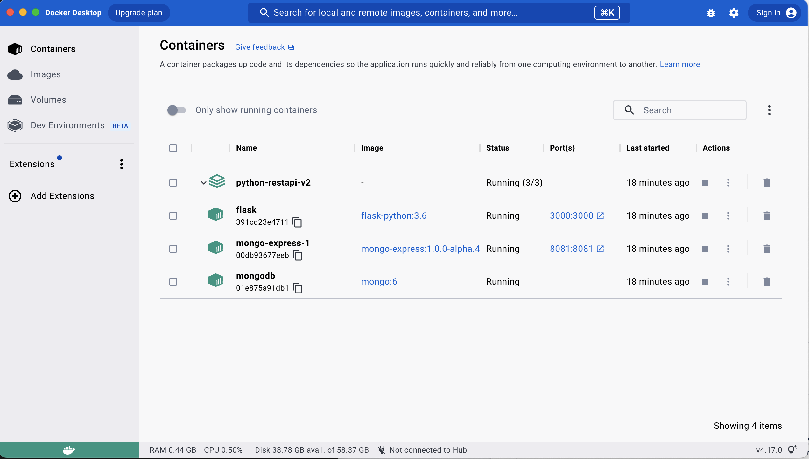

## API Documentation Page
After all services being up, a swagger API page can be accessed through [http://localhost:3000/](http://localhost:3000/).


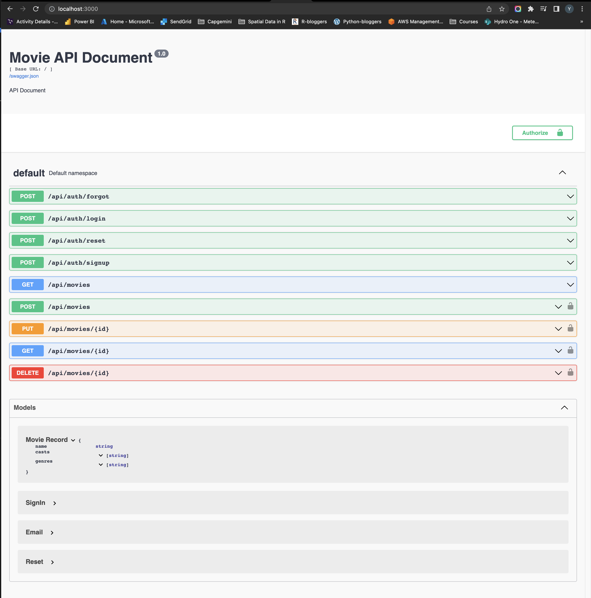

### Authentication
The first step is to login as a new user. If it success 200, a **user.id** will return.

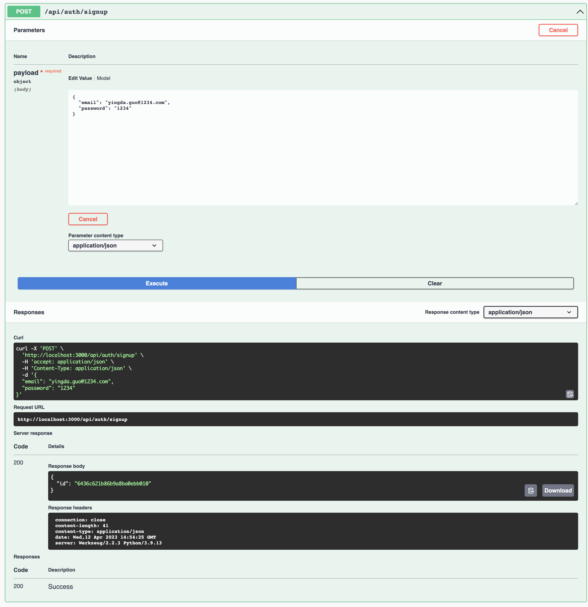

The next step is to use the email and password just registered to get a JWT token for accessing data in MongoDB.

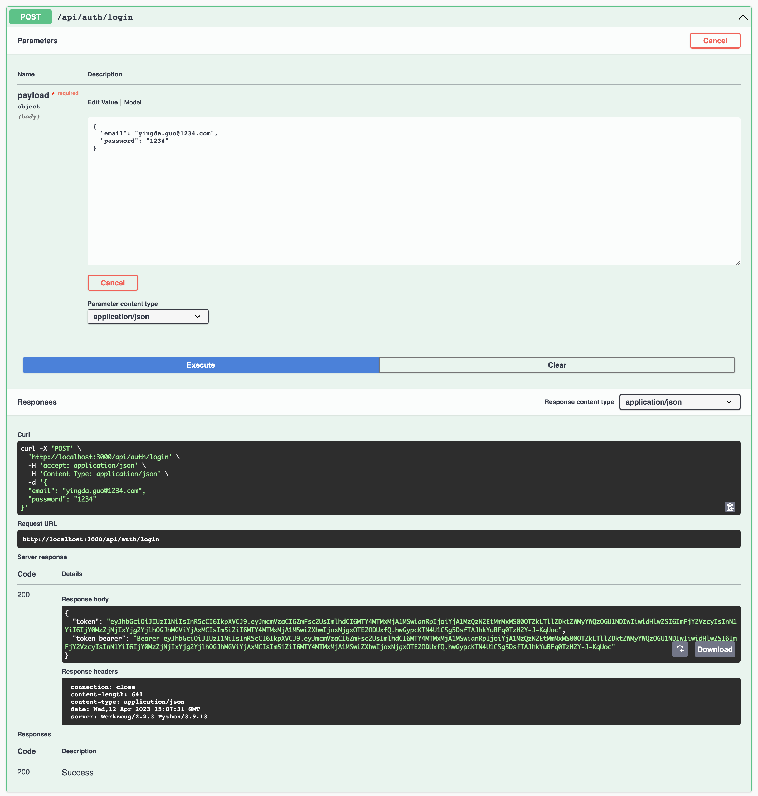

There are two types of token being generated: one without Bearer prefix which can be used in API test tool like Postman; the other one with Bearer can be used for **curl** and for code.

Using the JWT token, we can unlock API quires which require authorization. To do this, simply click **Authorize** in the UI and pase the token with Bearer prefix.

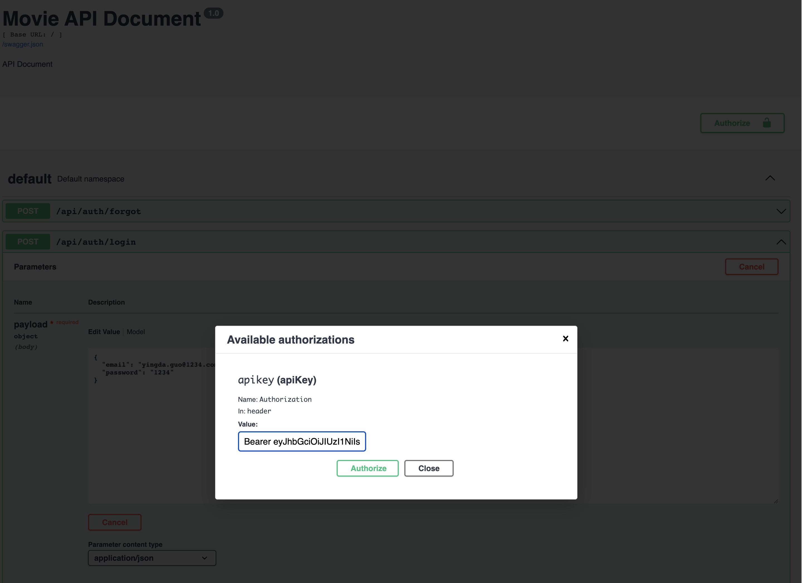


### Insert
After adding JWT authentication, we are now able post data to the MongoDB through our API.

```
{
    "name": "The Godfather ",
    "casts": ["Marlon Brando", "Al Pacino", "James Caan", "Diane Keaton"],
    "genres": ["Crime", "Drama"]
}
```

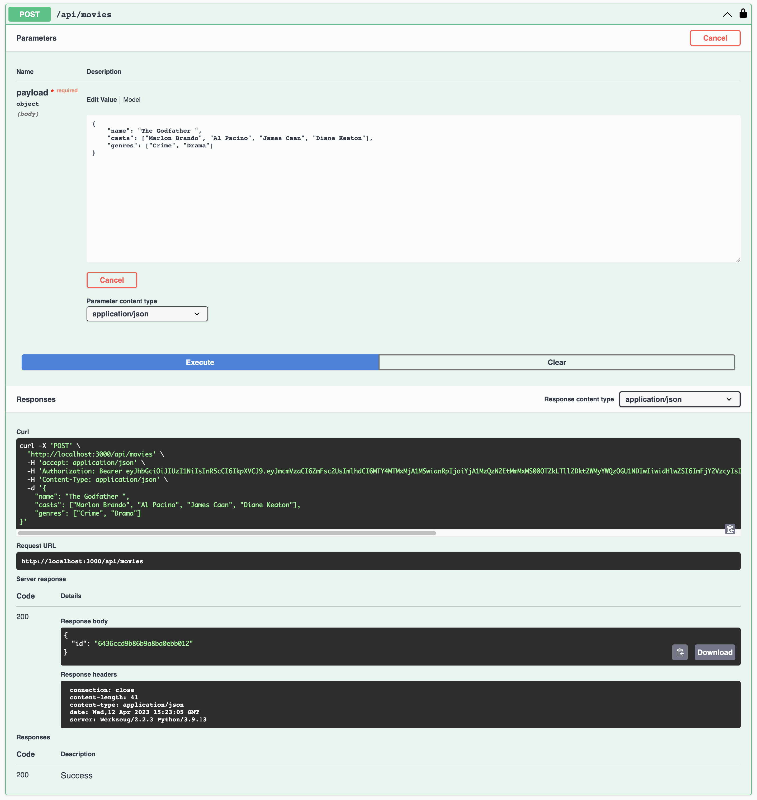


### Get
To check the uploaded data, we run **Get** movies through api.

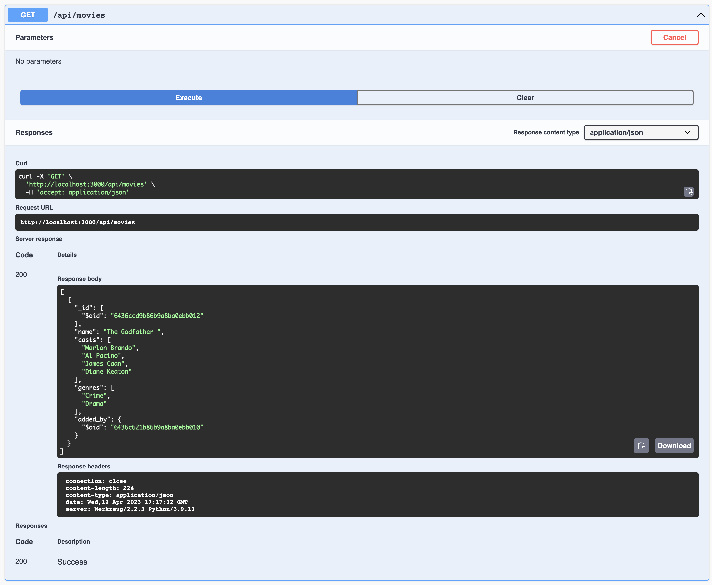


### Update & Delete
The update and delete can be easily done through corresponding **Put** and **DELETE** queries using movie's id.

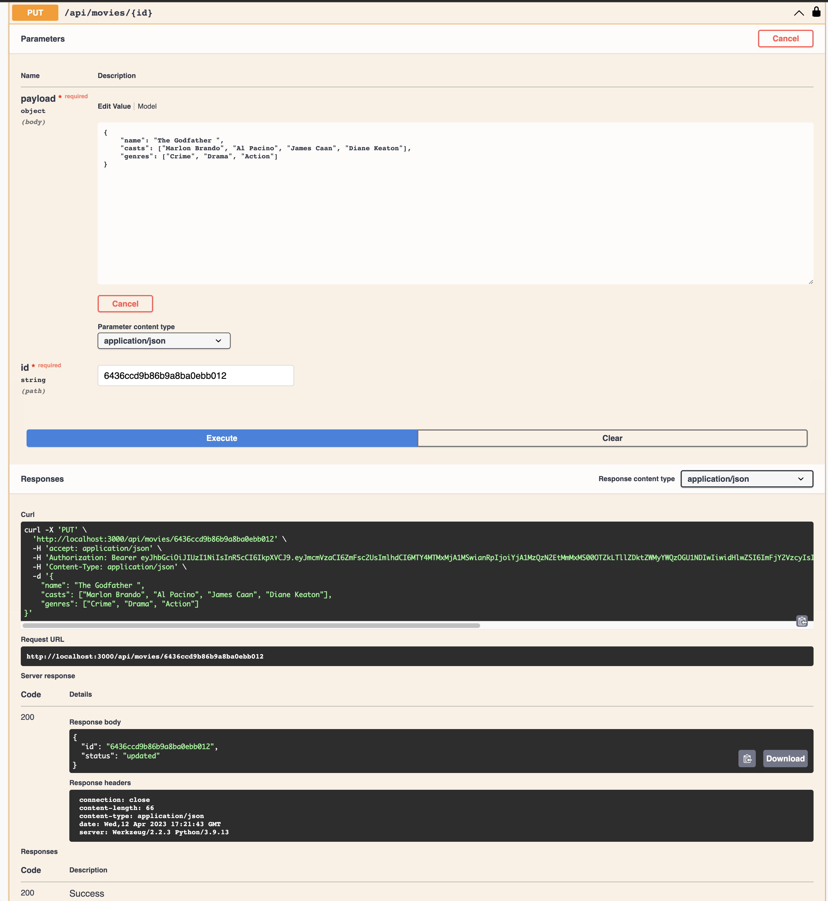
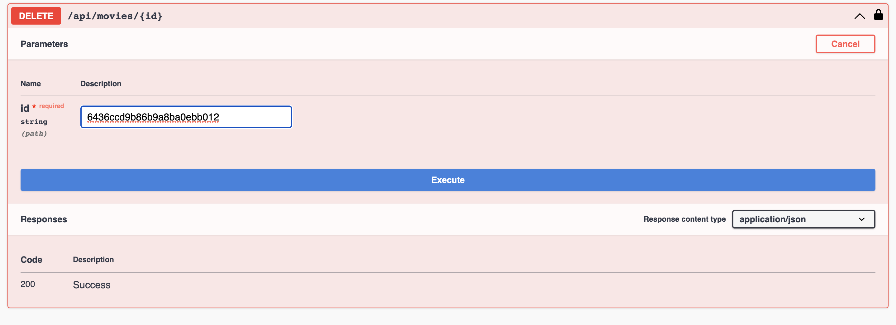


## Mongo Express

The Mongo Express service can be accessed through [http://localhost:8081/](http://localhost:8081/) with default **username:user** and **password:123** which can be modified through docker compose file.

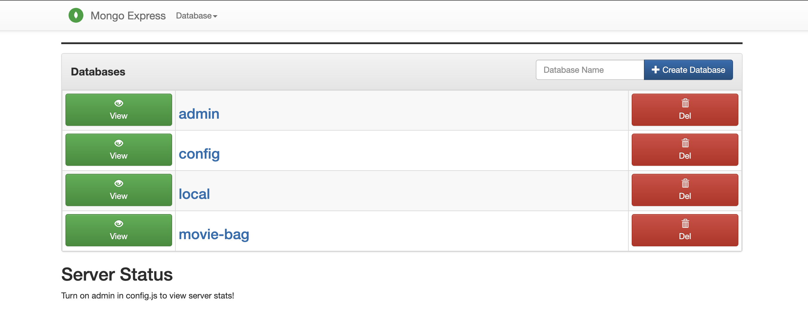


It supports all database functionalities such as: **add, update, import, export, indexing**.

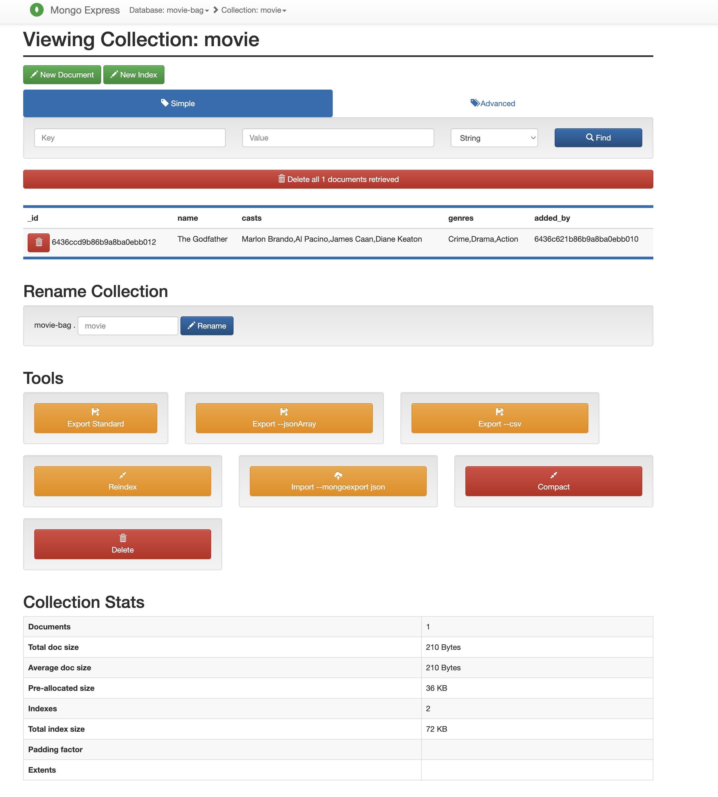


## Postman
Finally, a Postman JSON file saved in the **Postman** folder is provided which can be used for debugging and future development.

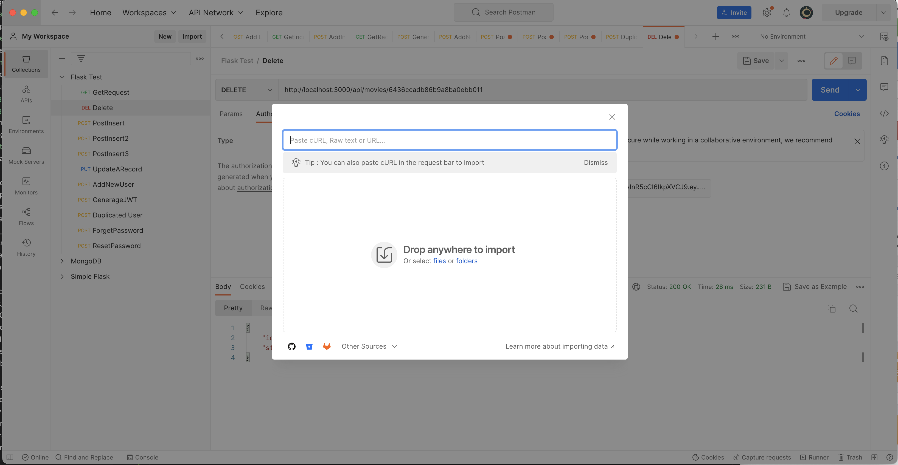

## Reference ##
[Flask Rest API - Zero to Yoda](https://dev.to/paurakhsharma/flask-rest-api-part-0-setup-basic-crud-api-4650)

